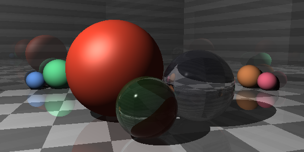
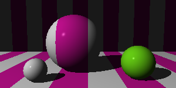
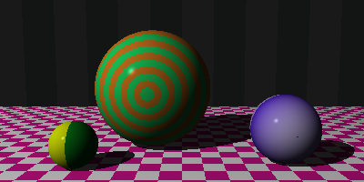
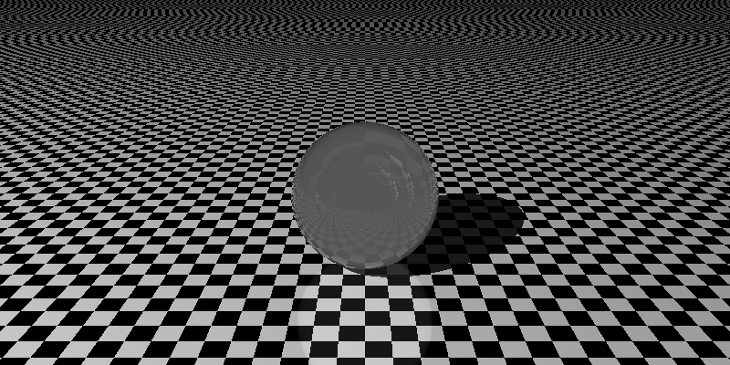
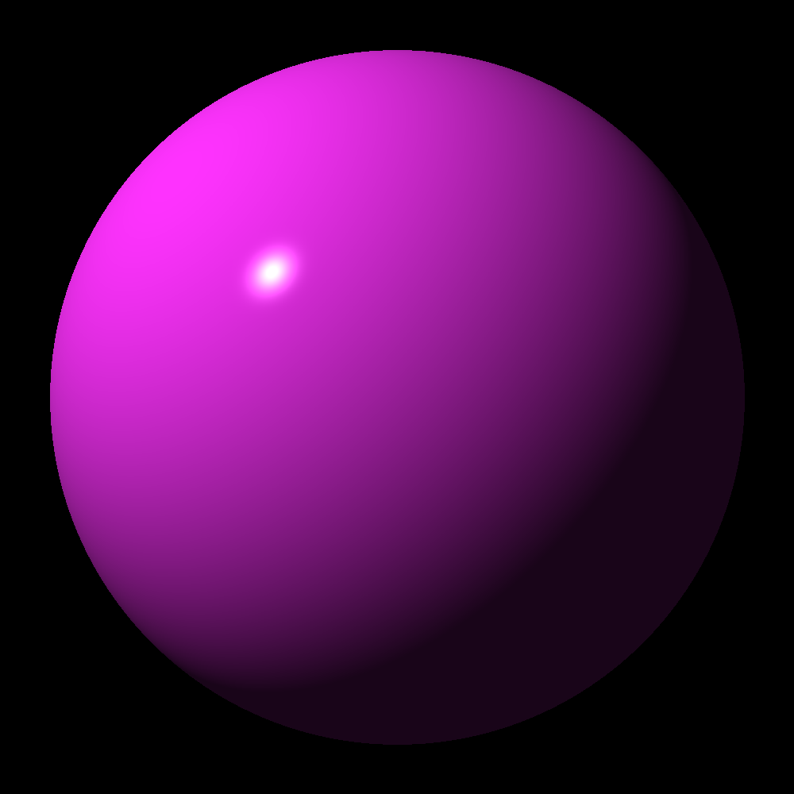

# Ray Tracer

Ray Tracer is a C-based ray tracing project that renders 3D scenes with features like reflections, refractions, and various patterns. This project was developed as a learning exercise and continuously refined through numerous commits.

### Glass-like Transparent Spheres


## Table of Contents
- [Overview](#overview)
- [Features](#features)
- [Installation & Usage](#installation--usage)
- [Project Timeline & Commit History](#project-timeline--commit-history)
- [Screenshots](#screenshots)
- [Credits & Acknowledgments](#credits--acknowledgments)

## Overview
This ray tracer is implemented in C and renders scenes featuring:
- Spheres, planes
- Material properties such as reflection, transparency, and refraction
- Various patterns including ring, checker, and gradient
- Lighting calculations using Phong shading and Schlick's approximation for reflectance

Note: This project currently does not include a Makefile. Please compile using your preferred build commands.

## Features
### Reflections & Refractions
Implementations for reflective surfaces and glass-like transparency.

### Pattern Support
Ring, checker, and gradient patterns are available for object materials.

### Robust Intersection Handling
The code supports multiple intersections per ray with proper sorting and handling of edge cases (including z-fighting prevention).

### Memory Management
Memory leaks have been fixed and dynamic allocation is used for intersections.

### Advanced Transformations
Includes operations for translation, rotation (x, y, z), scaling, and inverse matrices.

## Installation & Usage
Clone the repository:
```bash
git clone https://github.com/RychkovIurii/Ray_Tracer_Challenge
cd raytracer
```

### Compilation
Since there is no Makefile yet, compile manually. For example:
```bash
gcc -Wall -Wextra -Werror -o raytracer src/*.c -I include -lm
```

### Run the Renderer
```bash
./raytracer
```

### Output
Rendered images are saved in the `result/` directory (previously PPM files).

## Project Timeline & Commit History
Below is a summary of key commit highlights:

**Feb 13, 2025:**
- "Moved PPM to result."
	- Organized output by moving rendered PPM images to the result/ directory.

**Feb 12, 2025:**
- "Merge pull request #1 from RychkovIurii/debuf-refactoring"
	- Verified: "Success!! We got glass. Transparency and refraction work!"
	- "Implemented new scene. Doesn't work properly. Still some issue with transparency."

**Feb 11, 2025:**
- "Something wrong with refraction. Upload examples."
- "Added pictures."
- "Removed debugging messages."
- "Draft with debugging messages. Tests for refactoring. Still in progress. Should think how can we keep track of refractions."

**Feb 10, 2025:**
- "Draft. Implemented refracted_color, added to shade_hit. Next step: I will test it."
- "Added ft_lstremove."
- "Working on refraction. Still draft."
- "Fixed memory leaks. No leaks anymore."

**Feb 7, 2025:**
- "Upload reflection result."
- "Reflection."
- "Added ring, checker, gradient patterns."
- "Refactoring and patterns."
- "Plane and pattern."
- "Refactoring for a sphere."

**Earlier Commits (Feb 5–Feb 4, 2025 and January):**
- Implementation of essential components such as is_shadowed, prepare_computations, view transformation, ray intersections, matrix operations, vector routines, and more.
- Continuous refactoring, testing, and adding documentation for functions.


## Screenshots
## Screenshots
Screenshots of rendered scenes are available in the `result/` directory. These illustrate:

### Glass-like Transparent Spheres


### Reflections and Multiple Patterns on Objects



### Various Test Scenes Used During Development

---



### Makefile
A Makefile is not yet provided. Adding one is planned for future releases.

### Performance Improvements
Optimizations (e.g., spatial data structures) and additional features (like more complex materials) are under consideration.

## Credits & Acknowledgments
Developed by RychkovIurii.
